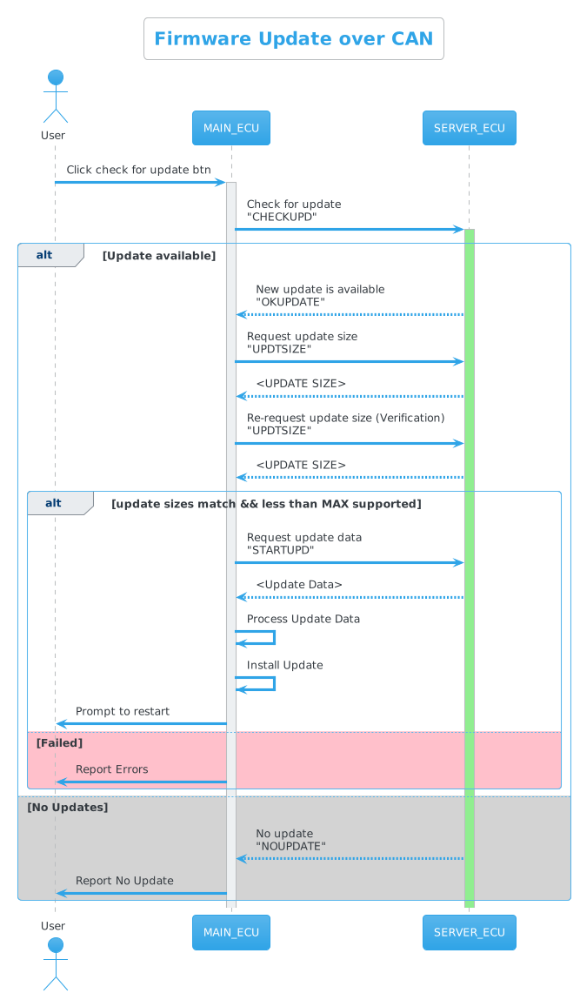

# EME - Egypt Makes Electronics

## Class 3 SEITech Solutions

### Team Members
- Hossam Elwahsh (1055) -  
- Ahmed Hisham (1023) - 
- Ahmed Sakr (755) - 
- Nada Salloum (1139) - 
- Salma Faragalla (199) - 
- Norhan Mohamed (764) - 
### ARM Project
### Firmware update over the CAN bus 
### Project Description
This project provides a simple framework for performing firmware updates for STM32F103C8T6 microcontroller over the CAN bus. 
A custom bootloader is responsible for switching between the 2 firmware versions using 2 buttons.
##### Objective
Update the initial firmware running on the STM32 that toggles the blue LED every 2 sec. 
to a new firmware that toggles the blue LED every 1 sec.
#### Video - Youtube:

#### Communication Plan

#### Dist Files

| ECU | APP               | Build File                           | Description                                                                                                                                                                            |
|-----|-------------------|--------------------------------------|----------------------------------------------------------------------------------------------------------------------------------------------------------------------------------------|
| 1   | Custom Bootloader | [hex](dist/custom_bootloader.hex)    | Handles switching between updates, Supports override mode by holding SW (1) to force boot into "main application" skipping loading updated app which is the default behavior if found. |
| 1   | Main Application  | [hex](dist/firmware_application.hex) | Main firmware application handles CAN communication, checking for updates, OLED display step by step, Toggles an LED every 2 seconds in the background.                                |
| 2   | Update Server     | [hex](dist/update_server.hex)        | Runs on a separate ECU, Communicates over CAN, serves new updates to requesting ECUs                                                                                                   |
| -   | Blink Update      | [hex](dist/LED_BLINK.hex)            | Updated application that blinks LED every 1 second                                                                                                                                     |

#### Memory Map 
|          APP        |        Address Range       | Flash Size |
|:-:                  |:-:                         |:-:         |
| Custom Bootloader   | 0x0800 0000 - 0x0800 1800  |     6K     |
| Updated Application | 0x0800 1C00 - 0x0800 3800  |     7K     |
| Main Application    | 0x0800 4C00 - 0x0800 AC00  |     24K    |

---
### General Operational Notes
#### To add a New Update Application to the server ECU 
1. Convert updated firmware Bin file e.g. [LED_Blink.bin](LED_BLINK/Debug/LED_BLINK.bin) to an array 
using this tool: https://notisrac.github.io/FileToCArray/
2. Add Padding of `0xFF` if needed to keep `array_size % 8 = 0` to facilitate flashing
3. **Make sure your data array won't exceed 7000 bytes [per design - updated will be refused]**
4. Update [app2_data.h](update_server/Core/Inc/app2_data.h) `APP_UPDATE_SIZE` with the new array size
5. Update [app2_data.c](update_server/Core/Src/app2_data.c) with the new array contents
6. Re-compile and flash

#### Notes on Bootloader Operation
- Bootloader automatically checks if there's a new version flashed, if yes it will boot to the new updated version directly.
- Bootloader behavior can be overridden by holding (SW-1) or (SW-2) during boot to force entry of Application 1 (main app) or Application 2 (update) respectively.

